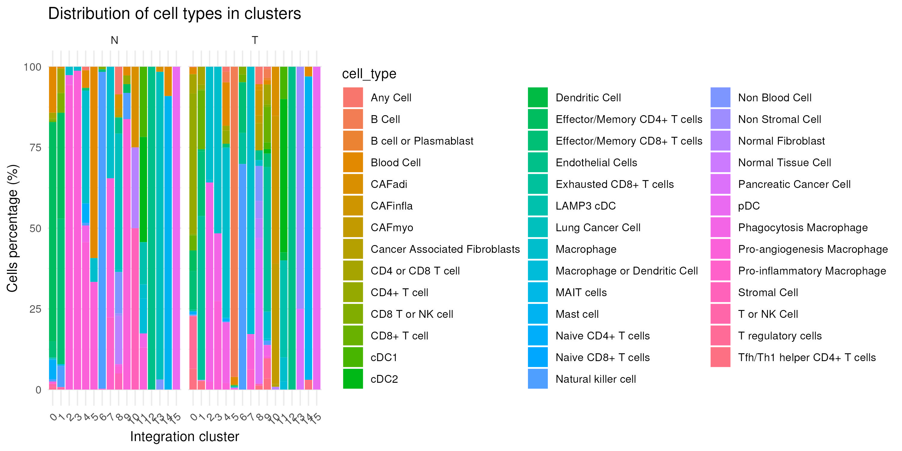

```{r, include = FALSE}
knitr::opts_chunk$set(
  collapse = TRUE,
  comment = "#>"
)
library(ProjectAlessandra)
library(data.table)
library(ggplot2)
```

## October 2025 project

The project here has been originated as a didatic and research exercise to:

-   develop modular R scripts for realistic omics workflows;
-   demonstrate how to handle heterogeneous biomedical datasets;
-   quantitatively compare base R (data.frame) and high-performance data.table implementations in real analytical contexts.

## Overview

The ProjectAlessandra package provides a collection of reproducible R functions designed to process, integrate and summarize multi-omics datasets - including bulk RNA-seq, ATAC-seq, genetic variants, and clinical data. Its primary goal is to streamline exploratory analyses, quality control, and data summarization by combining fast aggregation (via data.table) with reproducible reporting in R Markdown.

Each function corresponds to one step of a realistic bioinformatics workflow, from basic data import and summarization to genomic interval matching and cohort integration.

The pipeline concludes with a comparative performance benchmark so two complementary implementations with identical analytical logic but distinct computational paradigms are provided for every task:

-   a data.frame-based version;
-   a data.table-based version for performance and scalability on large databases.

This dual implementation allows users to both learn step-by-step data manipulation in R and quantify computational efficiency gains in real-world omics contexts.

This vignette demonstrates the main workflow for using functions in ProjectAlessandra, illustrating how each task contributes to a full omics analysis pipeline, how outputs can be summarized and visualized and finally how data.table compares to data.frame in terms of speed and computational efficiency.

## Task 1 --- Bulk RNA-seq Counts Summary

The function bulk_counts_summary_dt() provides a fast and intuitive way to summarize bulk RNA-seq count data in combination with sample metadata.

### Workflow description

The function performs the following steps:

1.  Input reading --- Loads two CSV files: one containing raw bulk RNA-seq counts (columns such as sample_id, gene, count); one containing sample metadata (e.g., sample_id, condition).

2.  Merging --- Joins the count and metadata tables by the shared column sample_id.

3.  Filtering --- Selects only treated samples whose gene names start with "GENE_00", allowing quick focus on specific targets or quality-control subsets.

4.  Computation of summary statistics: Computes mean and median counts per gene across the filtered data. Computes mean counts per gene and condition across all samples.

5.  Output --- Returns a list containing three data.table objects:

-   filtered_data: the subset of treated samples and selected genes;
-   gene_mean_median: gene-wise mean and median counts;
-   gene_condition_means: mean count per gene and condition.

This workflow is designed for quick quality control and exploratory summaries in large RNA-seq datasets.

### Syntax example for bulk_counts_summary_dt function

```{r}
result <- bulk_counts_summary_dt(
  "project_oct25/bulk_counts_long.csv",
  "project_oct25/sample_metadata.csv"
  )

filtered_data <- result$filtered_data
gene_mean_median <- result$gene_mean_median
gene_condition_means <- result$gene_condition_means
```

### Output

```{r, echo=FALSE, results='asis'}
knitr::kable(head(filtered_data, 5))
knitr::kable(head(gene_mean_median, 5))
knitr::kable(head(gene_condition_means, 5))
```

### Notes

This analysis step is usually the first stage of an RNA-seq bulk workflow, serving to:

-   Validate data integrity after merging;
-   Identify expression patterns between treated and control conditions;
-   Provide baseline summaries before normalization or differential expression analysis.

## Task 2 --- QC-style Derived Columns

The function bulk_counts_qc_dt() provides a quick way to generate quality control (QC)-style derived columns from raw bulk RNA-seq counts. It mimics preprocessing steps often used in QC pipelines to visualize count distributions, detect outliers, and prepare data for downstream normalization or exploratory plots.

### Workflow description

The function performs the following steps:

1.  Input reading --- Loads a CSV file containing bulk RNA-seq count data with columns: gene,sample_id, count

2.  Log2 transformation --- Adds a new column log2_count containing the log₂-transformed counts: log2_count = log2(count) This transformation stabilizes variance and makes distributions more symmetric, which is helpful for QC visualization (e.g., MA plots, density plots).

3.  Binary flag creation --- Adds a logical column high that indicates whether each count is above the gene-wise median: high = (count \> median(count by gene)) This allows simple visual or statistical differentiation between "high" and "low" expression values for each gene.

### Output

Returns a data.table with the original columns plus:

-   log2_count: log-transformed counts
-   high: binary flag (TRUE if above the gene's median, otherwise FALSE)

### Syntax example for bulk_counts_qc_dt function

```{r}

qc_data <- bulk_counts_qc_dt("project_oct25/bulk_counts_long.csv")
```

### Output

```{r, echo=FALSE, results='asis'}
knitr::kable(head(qc_data, 5), caption = "QC-style derived columns: log2_count and high flag")
```

### Notes

This QC-style computation is a lightweight but essential step for:

-   Inspecting the distribution of gene expression values;
-   Detecting potential outliers or abnormally expressed genes;
-   Preparing visual summaries before normalization or filtering.

It provides a reproducible, data.table-based foundation for building more advanced QC metrics and visual diagnostics in the ProjectAlessandra workflow.

## Task 3 --- Subset by Gene and Sample

The function subset_counts_dt() compares two approaches to subsetting large RNA-seq datasets:

-   Standard subsetting without indexing.
-   Optimized subsetting after applying a secondary index on gene and sample_id.

It returns a benchmark table showing the execution time for both methods, helping identify efficiency gains.

### Workflow description

The function performs the following steps:

1.  Input reading --- Loads two CSV files:

-   One containing RNA-seq counts (gene, sample_id, count);
-   One containing metadata (sample_id, condition, batch, patient_id, timepoint).

2.  Merging --- Joins metadata with the counts table on sample_id, ensuring contextual sample information is available for downstream analysis.

3.  Benchmarking setup ---

-   First, subsets the counts table without any index.
-   Then, applies a secondary index on the columns gene and sample_id using setindex() and repeats the same subsetting operation.

4.  Timing and comparison: measures system and user time for both operations and summarizes the results in a benchmarking table.

5.  Output --- Returns a data.table with three timing columns (user, system, elapsed) comparing subsetting with and without indexing.

This workflow helps quantify performance improvements in large-scale omics datasets and provides a reproducible test of indexing efficiency.

### Syntax example for bulk_counts_summary_dt function

```{r}
benchmark_dt <- subset_counts_dt(
counts_path = "project_oct25/bulk_counts_long.csv",
meta_path = "project_oct25/sample_metadata.csv",
gene_call = "GENE_00123",
sample_chosen = "SAMPLE_045"
)
```

### Output

```{r, echo=FALSE, results='asis'}
knitr::kable(benchmark_dt)
```

### Notes

This benchmarking step is essential for large RNA-seq workflows where performance scaling is critical. It allows users to:

-   Evaluate the impact of secondary indexing in data.table for fast subsetting;
-   Identify bottlenecks when handling millions of observations;
-   Implement more responsive pipelines in large bioinformatics projects.

The use of secondary indices can reduce elapsed time by several orders of magnitude depending on data size, making this approach particularly valuable in iterative analyses and reproducible reporting.

## Task 4 - Annotate counts and summarize

The function annotate_counts_dt() combines and summarizes RNA-seq count data and sample metadata, performing key steps for exploratory analysis and quality control in patient-level studies.

### Workflow description

The main steps include:

1.  Input reading --- Loads two CSV files:

-   Counts table with columns gene, sample_id, count;
-   Metadata table with columns sample_id, condition, batch, patient_id, timepoint.

2.  Merging: Joins the count and metadata tables by sample_id using keyed joins in data.table, ensuring only matched samples are retained.

3.  Computation of patient-level summaries: Calculates total RNA-seq counts per patient, providing a quick overview of sequencing depth and potential outliers.

4.  Gene-level summaries by condition: Computes mean counts per gene within each experimental condition, enabling downstream comparison of average expression.

5.  Top 10 genes per condition --- Ranks genes by mean expression and extracts the top 10 most expressed genes per condition, providing immediate biological insight.

6.  Output --- Returns a list containing:

-   patient_tot: total count per patient
-   top10: top 10 genes per condition ranked by mean expression

### Syntax example for bulk_counts_summary_dt function

```{r}
result <- annotate_counts_dt(
counts_path = "project_oct25/bulk_counts_long.csv",
meta_path = "project_oct25/sample_metadata.csv"
)

patient_tot <- result$patient_tot
top10 <- result$top10
```

### Output

```{r, echo=FALSE, results='asis'}
knitr::kable(head(patient_tot, 5), caption = "Patient total counts")
knitr::kable( top10 , caption = "Top 10 genes per condition")
```

### Notes

This task provides a critical bridge between raw count data and metadata-driven biological interpretation. It is typically used to:

-   Check consistency between patient identifiers and sequencing runs;
-   Assess sample quality by total count per patient;
-   Identify genes with the strongest expression signals in each experimental group;
-   Generate compact summaries for downstream visualization and normalization pipelines.

By leveraging data.table joins and grouped aggregations, the workflow ensures both computational efficiency and reproducibility in large omics projects.

## Task 5 - Classify lab values

This function is designed to efficiently evaluate clinical laboratory data within large patient cohorts. It helps in identifying which patients or lab tests show the highest frequency of out-of-range values --- a key component of exploratory clinical analyses and data quality control.

### Workflow description

The main steps are:

1.  Input reading --- Loads two CSV files:

-   Labs table with columns patient_id, time_iso, lab, value;
-   Reference table with columns lab, sex, lower, upper, defining the normal range for each test.

2.  Preprocessing: Extracts unique combinations of lab, lower, and upper from the reference table to ensure clean joins.

3.  Merging: Combines the lab results with their corresponding reference intervals using a join on lab.

4.  Classification: Adds a new column status indicating whether the lab value falls within the normal range ("normal") or outside it ("out_of_range").

5.  Summarization: Computes two levels of aggregation:

-   By patient → total number of tests and number of out-of-range results per patient;
-   By lab → total number of tests and number of out-of-range results per lab test.

6.  Output --- Returns a list containing: merged_labs:

-   the complete annotated dataset with status classification;
-   abnormal_by_patient: summary of abnormalities per patient;
-   abnormal_by_lab: summary of abnormalities per lab test.

### Syntax example for bulk_counts_summary_dt function

```{r}
result <- classify_labs_dt(
labs_path = "project_oct25/clinical_labs.csv",
ref_path = "project_oct25/lab_reference_ranges.csv"
)

merged_labs <- result$merged_labs
abnormal_by_patient <- result$abnormal_by_patient
abnormal_by_lab <- result$abnormal_by_lab
```

### Output

```{r, echo=FALSE, results='asis'}
knitr::kable(head(merged_labs, 5), caption = "Merged lab results with status classification")
knitr::kable(head(abnormal_by_patient, 5), caption = "Abnormalities summarized by patient")
knitr::kable(head(abnormal_by_lab, 5), caption = "Abnormalities summarized by lab test")
```

### Notes

This analysis provides a foundation for clinical QC and data integrity assessment, helping identify:

-   Patients with unusually high numbers of abnormal lab results;
-   Tests that consistently fall outside expected ranges (potential assay issues or biological patterns);
-   Systematic deviations between cohorts or experimental conditions.

By leveraging vectorized operations in data.table, the function efficiently handles large hospital-scale datasets while maintaining readability and reproducibility.

## Task 6 - Match vitals to labs

This task illustrates how to synchronize datasets recorded at different time frequencies, such as periodic lab results and continuous vital sign monitoring, and how to quantify their relationships.

The function match_vitals_dt() aligns lab test results (e.g., CRP) with the nearest available vital sign readings (heart rate, HR, and systolic blood pressure, SBP) for each patient, using a rolling join strategy from data.table.

It also computes per-patient correlations between CRP values and matched vitals, enabling a fast exploration of clinical co-variation patterns.

### Workflow description

The main processing steps are:

1.  Input reading --- Loads two CSV files: Lab data (patient_id, time_iso, lab, value); Vital signs data (patient_id, time_iso, vital, value).

2.  Timestamp conversion and ordering: Converts time_iso columns to POSIXct format for time-aware joins, and sorts both datasets by patient_id and time_iso.

3.  Preparation of HR and SBP tables: Separates heart rate (HR) and systolic blood pressure (SBP) measurements from the vitals table, renaming their value columns appropriately.

4.  Rolling join (nearest-time matching) --- Performs two successive rolling joins:

-   First matches each lab test to the nearest HR reading;
-   Then matches to the nearest SBP reading. The joins are constrained by patient ID and minimize time differences in minutes.

5.  Lag computation: Calculates hr_lag_minutes and sbp_lag_minutes, representing the temporal distance between lab sampling and vital sign measurement.

6.  Correlation analysis - Extracts CRP measurements (lab == "CRP") and computes: Per-patient correlation between CRP and HR; Per-patient correlation between CRP and SBP.

7.  Output --- Returns a list containing:

-   labs_with_hr: labs matched to HR readings;
-   labs_with_vitals: labs matched to both HR and SBP;
-   cor_crp_hr: correlation table of CRP vs HR per patient;
-   cor_crp_sbp: correlation table of CRP vs SBP per patient.

### Syntax example for bulk_counts_summary_dt function

```{r}
result <- match_vitals_dt(
labs_path = "project_oct25/clinical_labs.csv",
vitals_path = "project_oct25/vitals_time_series.csv"
)

labs_with_vitals <- result$labs_with_vitals
cor_crp_hr <- result$cor_crp_hr
cor_crp_sbp <- result$cor_crp_sbp
```

### Output

```{r, echo=FALSE, results='asis'}
knitr::kable(head(labs_with_vitals, 5), caption = "Labs matched to nearest HR and SBP readings")
knitr::kable(head(cor_crp_hr, 5), caption = "Per-patient correlation: CRP vs HR")
knitr::kable(head(cor_crp_sbp, 5), caption = "Per-patient correlation: CRP vs SBP")
```

### Notes

This analysis provides a reproducible template for temporal alignment and correlation of heterogeneous clinical data. It enables rapid exploration of physiological relationships, for example:

-   How inflammatory markers (CRP) relate to cardiovascular status (HR/SBP);
-   How measurement timing affects observed variability;
-   Identification of patients with strong or weak lab--vital coupling.

By using data.table's roll = "nearest" functionality, this method scales efficiently to large hospital datasets while preserving precise time-matching behavior.

## Task 7 - Top peaks by score

The function top_peaks_dt() filters peaks by chromosome and coordinate range, then returns the top 50 peaks ranked by their signal score --- ideal for exploratory locus-level analyses. This task is particularly useful for focused genomic exploration, for example when investigating regulatory elements around a locus of interest or validating accessibility hotspots in ATAC-seq datasets.

### Workflow description

The function proceeds through the following steps:

1.  Input reading --- Loads a CSV file containing ATAC-seq peak information, typically with columns: chr, start, end, peak_id, score.

2.  Filtering by genomic range --- Selects only peaks that:

-   Belong to the specified chromosome (chr_sel), and
-   Have start positions within the defined range (start_min to start_max).

3.  Ranking by score: Sorts peaks in descending order of score, allowing rapid identification of the most significant peaks in the region.

4.  Selection of top peaks: Extracts the top 50 peaks by score to provide a compact summary of the most relevant accessible sites.

5.  Output --- Returns a data.table containing the top 50 peaks in the selected genomic region.

### Syntax example for bulk_counts_summary_dt function

```{r}
top_peaks <- top_peaks_dt(
peaks_path = "project_oct25/atac_peaks.bed.csv",
chr_sel = "chr2",
start_min = 2000000,
start_max = 4000000
)
```

### Output

```{r, echo=FALSE, results='asis'}
knitr::kable(head(top_peaks, 10), caption = "Top 10 peaks by score within chr2:2,000,000–4,000,000")
```

### Notes

This function offers a lightweight yet powerful approach to region-based filtering and prioritization of ATAC-seq peaks. It is often used as an initial exploratory step to:

-   Inspect chromatin accessibility around a specific locus or gene promoter;

-   Compare signal strength between genomic intervals;

-   Select peaks for downstream motif enrichment or visualization in genome browsers.

By leveraging data.table filtering and ordering, the function maintains excellent performance even on large genome-wide peak sets.

## Task 8 - Gene stats and filtering

This task represents a typical step in RNA-seq exploratory analysis --- summarizing expression statistics per condition and pre-selecting genes of interest before differential expression testing. The function gene_stats_filter_dt() summarizes gene-level expression patterns and identifies genes showing substantial upregulation under treatment (treated mean ≥ 2× control mean).

### Workflow description

The function executes the following steps:

1.  Input reading --- Loads two CSV files:

-   A counts table with columns gene, sample_id, count;
-   A metadata table with columns sample_id, condition, batch, patient_id, timepoint.

2.  Merging: Joins count data with sample metadata by sample_id, ensuring condition labels are associated with each gene measurement.

3.  Computation of descriptive statistics - For each combination of gene and condition, computes:

-   Mean and median count;
-   First and third quartiles (Q1 and Q3). These provide a robust summary of gene expression variability.

4.  Comparison between treated and control conditions --- Extracts mean counts separately for treated and control samples and merges them into a wide format.

5.  Filtering by fold-change threshold --- Keeps only genes with treated_mean ≥ 2 × control_mean, highlighting those with potential biological significance.

6.  Output --- Returns a list containing:

-   stats_by_gene_condition: full summary table by gene and condition;
-   kept_genes: filtered table of genes passing the fold-change threshold.

### Syntax example for bulk_counts_summary_dt function

```{r}
result <- gene_stats_filter_dt(
counts_path = "project_oct25/bulk_counts_long.csv",
meta_path = "project_oct25/sample_metadata.csv"
)

stats_by_gene_condition <- result$stats_by_gene_condition
kept_genes <- result$kept_genes
```

### Output

```{r, echo=FALSE, results='asis'}
knitr::kable(head(stats_by_gene_condition, 5), caption = "Per-condition gene summary statistics")
knitr::kable(head(kept_genes, 10), caption = "Genes with treated_mean ≥ 2 × control_mean")
```

### Notes

This workflow is designed for quick prioritization of genes showing strong upregulation in treated samples. It is particularly useful to:

-   Validate trends before differential expression testing;

-   Assess distribution and consistency of gene-level summaries;

-   Identify genes that might serve as early biomarkers or treatment responders.

By leveraging grouped aggregation in data.table, this step remains scalable and reproducible for large bulk RNA-seq datasets.

## Task 9 - Wide → Long → Wide

RNA-seq or ATAC-seq count matrices are typically stored in wide format, where each column represents a sample. However, many operations, such as joining with metadata or computing per-condition summaries, are easier in long format. This task illustrates:

-   Conversion of a count table from wide → long form;

-   Integration with sample metadata;

-   Calculation of per-condition means;

-   Reconstruction into a condition-wide table.

### Workflow description

1.  Input reading --- Loads two CSVs:

-   counts_wide_path: a wide table with one column per sample (gene, sample1, sample2, ...);
-   meta_path: metadata table with sample_id, condition, batch, patient_id, etc.

2.  Wide → Long transformation --- Uses melt() to convert the wide matrix into a long table with columns: gene \| sample_id \| count

3.  Metadata merge: Joins long-format counts with metadata to associate each measurement with experimental context.

4.  Totals per sample (QC): Computes the sum of counts for each sample_id, which can be used for normalization checks.

5.  Per-condition mean computation: Aggregates mean counts by gene and condition using data.table grouping.

6.  Long → Wide transformation --- Converts the summarized data back into a wide table via dcast(), resulting in: gene \| control \| treated

7.  Output --- Returns a data.table counts_condition_wide with mean expression counts by condition

### Syntax example for bulk_counts_summary_dt function

```{r}
counts_condition_wide <- wide_long_wide_dt(
counts_wide_path = "project_oct25/bulk_counts_wide.csv",
meta_path = "project_oct25/sample_metadata.csv"
)
```

### Output

```{r, echo=FALSE, results='asis'}
knitr::kable(head(counts_condition_wide, 10),
caption = "Mean gene counts per condition (wide format)")
```

### Notes

This task demonstrates a core data manipulation pattern for expression analysis. Key advantages:

-   Enables integration of expression data with metadata for flexible summarization.

-   Simplifies visualization or downstream modeling.

-   Produces clean, reproducible tables per condition for plotting or exporting.

The reshaping process is memory-efficient and fast thanks to data.table::melt() and data.table::dcast().

## Task 10 - ATAC peaks to genes

In ATAC-seq analysis, each peak represents an accessible genomic region. To interpret biological relevance, these peaks are often mapped to nearby or overlapping genes. This task performs genomic overlap detection using data.table::foverlaps(), a highly efficient method for interval joins.

### Workflow description

1.  Input reading --- Loads two CSV files:

-   peaks_path: ATAC peaks table with columns chr, start, end, peak_id, and score.
-   genes_path: gene coordinate table with columns chr, start, end, and gene.

2.  Key assignment for intervals --- Both datasets are keyed by chromosome and genomic interval (chr, start, end) to enable fast overlap operations.

3.  Overlap detection --- Uses foverlaps() to identify peaks intersecting with genes. This efficiently matches any region in peaks that overlaps a gene interval in genes.

4.  Overlap length computation --- Calculates the number of base pairs (overlap_bp) in each overlap using. Only positive overlap lengths are retained.

5.  Summarization:

-   peaks_per_gene: counts how many peaks overlap each gene.
-   overlap_sum_per_gene: sums total overlapping base pairs per gene.

6.  Top genes identification --- Selects the top 20 genes with the largest total overlap (in base pairs), representing loci with the strongest ATAC-seq signal.

7.  Output --- Returns a list of three data.tables:

-   overlaps: detailed overlaps with coordinates and overlap length
-   peaks_per_gene: number of peaks per gene
-   top20_genes: top genes ranked by total overlap length

### Syntax example for bulk_counts_summary_dt function

```{r}
result <- atac_to_gene_dt(
peaks_path = "project_oct25/atac_peaks.bed.csv",
genes_path = "project_oct25/gene_annotation.bed.csv"
)

overlaps <- result$overlaps
peaks_per_gene <- result$peaks_per_gene
top20_genes <- result$top20_genes
```

### Output

```{r, echo=FALSE, results='asis'}
knitr::kable(head(peaks_per_gene, 5), caption = "Number of ATAC peaks per gene")
knitr::kable(top20_genes, caption = "Top 20 genes by total overlapping base pairs")
```

### Notes

This analysis bridges chromatin accessibility (ATAC-seq) and gene annotations, allowing identification of candidate regulatory regions near expressed genes. Typical downstream uses include:

-   Integrating ATAC-seq with RNA-seq to detect active promoters or enhancers;

-   Prioritizing genes in open chromatin regions;

-   Assessing condition-specific changes in accessibility.

## Task 11 - Variants to genes

The function variants_to_genes_dt() is particularly useful for integrating variant data with expression or regulatory information (e.g., ATAC-seq peaks from Task 10). Variants (SNPs, indels) are represented as single base positions, whereas genes are intervals in the genome. Mapping variants to genes allows:

-   Counting the number of variants per gene;

-   Focusing on variants with predicted HIGH functional impact;

-   Prioritizing genes for downstream analysis (e.g., correlation with expression or regulatory features).

### Workflow description

1.  Input reading --- Loads two CSV files:

-   variants_path: variant table with columns sample_id, chr, pos, ref, alt, impact;
-   genes_path: gene coordinates with columns chr, start, end, gene.

2.  Variant interval creation: Converts each variant into a 1-bp interval (start = pos, end = pos) so that foverlaps() can be applied.

3.  Key assignment: Sets keys on chr, start, end for both variants and genes to allow fast interval joins.

4.  Overlap detection: Uses foverlaps() to identify variants that fall within gene coordinates.

5.  Impact filtering: Retains only variants labeled "HIGH" (case-insensitive), indicating potential strong functional consequences.

6.  Aggregation:

-   Counts high-impact variants per gene and sample;
-   Aggregates total high-impact variants per gene, ranking genes by variant burden.

7.  Output - Returns genes_with_high, a vector of gene names carrying one or more HIGH-impact variants, ordered by total variant count.

### Syntax example for bulk_counts_summary_dt function

```{r}
genes_with_high <- variants_to_genes_dt(
variants_path = "project_oct25/variants.csv",
genes_path = "project_oct25/gene_annotation.bed.csv"
)
```

### Output

```{r, echo=FALSE, results='asis'}
knitr::kable(head(genes_with_high, 10), caption = "Genes carrying HIGH-impact variants")
```

### Notes

This task highlights the integration of genomic variant data with gene annotation, supporting:

-   Identification of candidate genes for functional studies;

-   Prioritization of variants in multi-omics integration workflows;

-   Linking high-impact variants with regulatory regions or expression changes.

It scales efficiently with data.table for large variant datasets, leveraging interval-based joins.

## Task 12 - Combine cohorts

The function combine_cohorts_dt() merges metadata tables, integrates them with RNA-seq counts, and identifies the top 100 most variable genes across cohorts.

This is particularly useful when analyzing multi-cohort datasets while maintaining per-cohort and per-condition summaries for exploratory analysis. In multi-cohort studies, RNA-seq data are often collected separately across cohorts. Combining cohorts requires:

-   Safe merging of metadata tables;

-   Alignment with counts;

Identification of genes with high variability to focus subsequent analyses on biologically relevant features.

### Workflow description

1.  Input reading --- Loads three CSV files:

-   cohortA_path and cohortB_path: metadata tables with columns sample_id, condition, batch, patient_id, timepoint, cohort;
-   counts_path: long-format counts table with columns gene, sample_id, count.

2.  Cohort annotation: Adds a cohort column to each metadata table (A or B) to track origin.

3.  Combining metadata tables: Uses rbindlist() to merge the two cohorts while preserving all metadata columns.

4.  Merging with counts: Joins combined metadata with the counts table using sample_id to associate expression values with cohort and condition.

5.  Gene variance computation: Calculates per-gene variance across all samples to identify the 100 most variable genes.

6.  Subset to top variable genes: Extracts counts for these top 100 genes, preserving cohort and condition information.

7.  Per-cohort, per-condition summary: Computes mean counts per gene, per cohort, and per condition.

8.  Output --- Returns top100_data, a table with counts for the most variable genes along with cohort and condition annotations.

### Syntax example for bulk_counts_summary_dt function

```{r}
top100_data <- combine_cohorts_dt(
cohortA_path = "project_oct25/cohortA_samples.csv",
cohortB_path = "project_oct25/cohortB_samples.csv",
counts_path  = "project_oct25/bulk_counts_long.csv"
)
```

### Output

```{r, echo=FALSE, results='asis'}
knitr::kable(head(top100_data, 10), caption = "Top 100 most variable genes with cohort and condition annotations")
```

### Notes

This task is essential for integrative analysis across cohorts. Advantages:

-   Preserves per-sample metadata for accurate stratification;

-   Focuses downstream analyses on high-variance genes, improving signal-to-noise ratio;

-   Scales efficiently with data.table for large datasets.

## Final revision

Final Revision provides a biologically meaningful synthesis of the previous analysis by integrating cell type annotations, integration clusters, and sample tissue information to produce combined summary tables, normalized percentages, and visualizations.

The function final_revision_dt() automates these steps for a reproducible overview of cell type distribution across integration clusters and tissue types, creating several output files in Outputs/.

This analysis is based on single-cell RNA-seq data that were pre-processed and clustered using Seurat. Two input files are provided:

-   annotated_GSM3516673_normal_annotated_GSM3516672_tumor_SeuratIntegration.csv, containing per-cell integration cluster information,

-   nt_combined_clustering.output.csv, containing predicted cell types and sample tissue classification (N for normal, T for tumor).

The overarching biological goal is to quantify and visualize how specific cell types distribute across integration clusters and to determine whether those clusters are preferentially associated with normal or tumor tissue.

### Workflow description

1.  Integration of annotations --- Merge cell-level cluster assignments with their corresponding cell type and sample type (normal/tumor).

2.  Cell type frequency counting --- Compute the number of cells of each type within every integration cluster.

3.  Cluster--tissue association summary --- Generate a summary table showing the relationship between: integration cluster, cell type, and tissue origin (normal vs tumor). Percentages are calculated both within clusters and within cell types, enabling detection of enrichment patterns.

4.  Visualization --- Create a bar plot representing the distribution of cell types across clusters, faceted by tissue type. This visualization helps highlight differential cell population structure between tumor and adjacent normal tissue.

5.  Normalized percentages --- Calculate normalized percentages of each cell type within clusters for both normal and tumor tissues, providing a fair comparison independent of total cell number.

## Task 1.1 --- Combine integration and clustering data

Merges integration_cluster information with cell_type and sample_type annotations. Outputs a combined table for downstream summaries.

```{r}
final_revision_dt(
integration_path = "project_oct25/annotated_GSM3516673_normal_annotated_GSM3516672_tumor_SeuratIntegration.csv",
clustering_path = "project_oct25/nt_combined_clustering.output.csv"
)
```

Output file: Outputs/combined_celltype_integrationcluster.csv

```{r, echo=FALSE, results='asis'}
combined_celltype_integrationcluster <- fread("Outputs/combined_celltype_integrationcluster.csv")
knitr::kable(head(combined_celltype_integrationcluster, 5))
```

## Task 2.1 --- Count cells per cluster and cell type

Computes the number of cells of each type within each integration cluster. Output file: Outputs/celltype_counts_per_cluster.csv

```{r, echo=FALSE, results='asis'}
celltype_counts_per_cluster <- fread("Outputs/celltype_counts_per_cluster.csv")
knitr::kable(head(celltype_counts_per_cluster, 5))
```

## Task 3.1 --- Summary table by cluster, cell type, and tissue

Generates a detailed table including:

-   Number of cells per cluster × cell type × sample type;

-   Total cells per cluster; - Percentages within cluster and within cell type;

-   Association to normal and tumor tissue.

Output file: Outputs/summary_cluster_celltype_tissue.csv

```{r, echo=FALSE, results='asis'}
summary_cluster_celltype_tissue <- fread("Outputs/summary_cluster_celltype_tissue.csv")
knitr::kable(head(summary_cluster_celltype_tissue, 5))
```

## Task 4.1 --- Visualization of cell type distribution

Creates a bar plot showing distribution of cell types across integration clusters in normal vs tumor tissue.

The plot is generated automatically within final_revision_dt() Bars represent the percentage of each cell type in a cluster; Faceted by sample_type (normal vs tumor).

{width="800"}

## Task 5.1 --- Normalized percentages per cluster and tissue

Computes normalized percentages of each cell type within integration clusters for normal and tumor tissue.

Output file: Outputs/normalized_celltype_percentages_by_tissue.csv

```{r, echo=FALSE, results='asis'}
knitr::kable(head(fread("Outputs/normalized_celltype_percentages_by_tissue.csv"), 5),
caption = "Normalized percentages of cell types per cluster and tissue")
```

### Biological interpretation

This workflow integrates all previous steps related to cell type and cluster annotation, providing both summary tables and visualization-ready outputs.

It connects computational clustering with biological meaning:

-   It reveals which cell populations (e.g., epithelial cells, immune cells, stromal cells) dominate specific clusters.

-   It highlights tumor-enriched clusters, potentially indicating transformed or infiltrating cell types.

-   It provides quantitative evidence for cellular heterogeneity between normal and tumor microenvironments.

Ultimately, this stage transforms purely computational results into interpretable biological insights --- closing the workflow from raw data to functional understanding.

## Comparative analysis

The comparative analysis quantitatively evaluates the performance difference between the data.frame and data.table implementations across all major tasks of the project. Using the microbenchmark package, each function pair (e.g., bulk_counts_summary_df() vs bulk_counts_summary_dt()) was executed 10 times under identical conditions, and the average execution time (in milliseconds) was recorded.

Each bar plot in this section displays the distribution of execution times for the two implementations. Lower bars indicate faster execution. In most cases, the data.table version executes significantly faster --- often by one to two orders of magnitude, especially for large join or grouping operations.

```{r, echo=FALSE, results='asis'}
library(microbenchmark)

# Task 1
bench1 <- microbenchmark(
  df_version = bulk_counts_summary_df("project_oct25/bulk_counts_long.csv", "project_oct25/sample_metadata.csv"),
  dt_version = bulk_counts_summary_dt("project_oct25/bulk_counts_long.csv", "project_oct25/sample_metadata.csv"),
  times = 10
)
task_1_plot<- autoplot(bench1)
task_1_plot + ggtitle("Task 1")

# Task 2
bench2 <- microbenchmark(
  df_version = bulk_counts_qc_df("project_oct25/bulk_counts_long.csv"),
  dt_version = bulk_counts_qc_dt("project_oct25/bulk_counts_long.csv"),
  times = 10
)
task_2_plot <- autoplot(bench2)
task_2_plot + ggtitle("Task 2")

# Task 4
bench4 <- microbenchmark(
  df_version = annotate_counts_df("project_oct25/bulk_counts_long.csv", "project_oct25/sample_metadata.csv"),
  dt_version = annotate_counts_dt("project_oct25/bulk_counts_long.csv", "project_oct25/sample_metadata.csv"),
  times = 10
)
task_4_plot <- autoplot(bench4)
task_4_plot + ggtitle("Task 4")

# Task 5
bench5 <- microbenchmark(
  df_version = classify_labs_df("project_oct25/clinical_labs.csv", "project_oct25/lab_reference_ranges.csv"),
  dt_version = classify_labs_dt("project_oct25/clinical_labs.csv", "project_oct25/lab_reference_ranges.csv"),
  times = 10
)
task_5_plot <- autoplot(bench5)
task_5_plot + ggtitle("Task 5")

 # Task 6
bench6 <- microbenchmark(
  df_version = match_vitals_df("project_oct25/clinical_labs.csv", "project_oct25/vitals_time_series.csv"),
  dt_version = match_vitals_dt("project_oct25/clinical_labs.csv", "project_oct25/vitals_time_series.csv"),
  times = 10
)
task_6_plot <- autoplot(bench6)
task_6_plot + ggtitle("Task 6")

# Task 7
bench7 <- microbenchmark(
  df_version = top_peaks_df("project_oct25/atac_peaks.bed.csv", "chr2", 2000000, 4000000),
  dt_version = top_peaks_dt("project_oct25/atac_peaks.bed.csv", "chr2", 2000000, 4000000),
  times = 10
)
task_7_plot <- autoplot(bench7)
task_7_plot + ggtitle("Task 7")

# Task 8
bench8 <- microbenchmark(
  df_version = gene_stats_filter_df("project_oct25/bulk_counts_long.csv", "project_oct25/sample_metadata.csv"),
  dt_version = gene_stats_filter_dt("project_oct25/bulk_counts_long.csv", "project_oct25/sample_metadata.csv"),
  times = 10
)
task_8_plot <- autoplot(bench8)
task_8_plot + ggtitle("Task 8")

# Task 9
bench9 <- microbenchmark(
  df_version = wide_long_wide_df("project_oct25/bulk_counts_wide.csv", "project_oct25/sample_metadata.csv"),
  dt_version = wide_long_wide_dt("project_oct25/bulk_counts_wide.csv", "project_oct25/sample_metadata.csv"),
  times = 10
)
task_9_plot <- autoplot(bench9)
task_9_plot + ggtitle("Task 9")

# Task 10
bench10 <- microbenchmark(
  df_version = atac_to_gene_df("project_oct25/atac_peaks.bed.csv", "project_oct25/gene_annotation.bed.csv"),
  dt_version = atac_to_gene_dt("project_oct25/atac_peaks.bed.csv", "project_oct25/gene_annotation.bed.csv"),
  times = 10
)
task_10_plot <- autoplot(bench10)
task_10_plot + ggtitle("Task 10")

# Task 11
bench11 <- microbenchmark(
  df_version = variants_to_genes_df("project_oct25/variants.csv", "project_oct25/gene_annotation.bed.csv"),
  dt_version = variants_to_genes_dt("project_oct25/variants.csv", "project_oct25/gene_annotation.bed.csv"),
  times = 10
)
task_11_plot <- autoplot(bench11)
task_11_plot + ggtitle("Task 11")

# Task 12
bench12 <- microbenchmark(
  df_version = combine_cohorts_df("project_oct25/cohortA_samples.csv", "project_oct25/cohortB_samples.csv","project_oct25/bulk_counts_long.csv"),
  dt_version = combine_cohorts_dt("project_oct25/cohortA_samples.csv", "project_oct25/cohortB_samples.csv","project_oct25/bulk_counts_long.csv"),
  times = 10
)
task_12_plot <- autoplot(bench12)
task_12_plot + ggtitle("Task 12")

#FINAL REVISION
benchfr <- microbenchmark(
  df_version = final_revision_df("project_oct25/annotated_GSM3516673_normal_annotated_GSM3516672_tumor_SeuratIntegration.csv", "project_oct25/nt_combined_clustering.output.csv"),
  dt_version = final_revision_dt ("project_oct25/annotated_GSM3516673_normal_annotated_GSM3516672_tumor_SeuratIntegration.csv", "project_oct25/nt_combined_clustering.output.csv"),
  times = 10
)
task_fr_plot <- autoplot(benchfr)
task_fr_plot + ggtitle("Final Revision")
```

The table below summarizes mean execution times (in milliseconds) for both approaches across all tasks.

```{r, echo=FALSE, results='asis'}
results <- rbindlist(list(
  task1 = as.data.table(bench1),
  task2 = as.data.table(bench2),
  task4 = as.data.table(bench4),
  task5 = as.data.table(bench5),
  task6 = as.data.table(bench6),
  task7 = as.data.table(bench7),
  task8 = as.data.table(bench8),
  task9 = as.data.table(bench9),
  task10 = as.data.table(bench10),
  task11 = as.data.table(bench11),
  task12 = as.data.table(bench12),
  final_revision = as.data.table(benchfr)
), idcol = "task")[, .(df_mean = mean(time[expr=="df_version"])/1e6,
                       dt_mean = mean(time[expr=="dt_version"])/1e6),
                   by = task]

knitr::kable(results)

```

The comparative analysis demonstrates that: data.frame remains simpler and ideal for small datasets or didactic purposes, while data.table enables high-speed, memory-efficient processing suitable for large-scale genomics and clinical data integration.

Across all tasks:

-   Tasks involving large merges and grouped aggregations (Tasks 1, 4, 6, 8, 12) show the greatest improvement with data.table, often running 10× to 100× faster.

-   Simpler operations (e.g., Task 2 -- log transformations, or Task 7 -- basic filtering) show minimal differences, as the computational bottleneck is small.

-   In interval-based analyses (Tasks 10 and 11), data.table provides major gains thanks to keyed joins and foverlaps()

### Conclusions of the project

This project successfully developed and benchmarked a complete multi-omics data analysis workflow implemented in R. Each task reproduces a realistic bioinformatics step --- from RNA-seq count summarization to ATAC-seq and variant integration --- using both traditional (data.frame) and optimized (data.table) paradigms.
